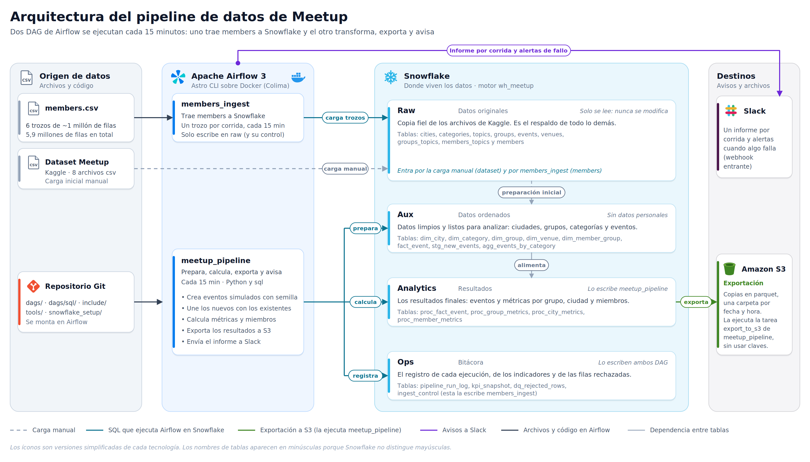

# Meetup Pipeline

Pipeline de datos que toma el dataset público de Meetup (Kaggle), lo organiza en Snowflake, calcula métricas sobre eventos y miembros, avisa por Slack y guarda los resultados en S3. Todo corre solo, cada 15 minutos, orquestado con Apache Airflow.

## Qué hace

1. **Trae los datos**: el archivo grande de miembros (casi 6 millones de filas) se carga en pedazos, uno por corrida, para no saturar nada.
2. **Los ordena**: limpia y organiza ciudades, grupos, categorías y eventos en tablas listas para analizar.
3. **Simula movimiento**: en cada corrida crea eventos nuevos y actualiza algunos existentes, para que siempre haya datos frescos que procesar.
4. **Calcula resultados**: métricas por grupo, ciudad y miembros, con controles de calidad antes de publicarlas.
5. **Avisa**: envía a Slack un informe por corrida con los indicadores y las alertas, y un aviso inmediato si algo falla.
6. **Guarda copias**: exporta los resultados a S3 en formato Parquet, en una carpeta por fecha y hora.

## Arquitectura



Dos procesos de Airflow trabajan sobre Snowflake, que está organizado en cuatro zonas:

| Zona | Para qué sirve |
|---|---|
| **Raw** | Copia fiel de los archivos originales. Solo se lee, nunca se modifica. |
| **Aux** | Datos ordenados y sin información personal: ciudades, grupos, categorías, eventos. |
| **Analytics** | Resultados finales: eventos y métricas por grupo, ciudad y miembros. |
| **Ops** | La bitácora: qué corrió, cuándo y con qué indicadores. |

## Los dos procesos

### `members_ingest`
Carga el archivo de miembros en 6 trozos de aproximadamente un millón de filas. Procesa un trozo cada 15 minutos, anota cuál ya cargó (si se repite no duplica datos), avisa a Slack y al final verifica que el total coincida.

### `meetup_pipeline`
El proceso principal. En orden:

1. Genera eventos nuevos.
2. Los une con los existentes.
3. Calcula métricas por grupo y por ciudad.
4. Revisa la calidad de los datos.
5. Toma una foto de los indicadores y registra la corrida.
6. En paralelo, exporta a S3 y envía el informe a Slack.

Las métricas de miembros solo se calculan cuando la carga de `members_ingest` está completa. Mientras tanto, el informe muestra el avance (por ejemplo, "3/6").

## El informe de Slack

Un solo mensaje por corrida con el estado, los eventos nuevos y actualizados, los indicadores con flechas ▲ ▼ frente a la corrida anterior, los principales rankings de categorías y ciudades, y las alertas, por ejemplo una caída fuerte en las confirmaciones de asistencia o varias cancelaciones seguidas.

## Datos personales

El archivo de miembros contiene datos de personas reales. Por eso:

- La copia original se guarda solo como respaldo y nunca sale de Raw.
- Las tablas de trabajo no incluyen nombre, biografía, foto, enlaces ni ubicación exacta.
- Lo que se publica (métricas, Slack, S3) son resultados agrupados, y los grupos con menos de 5 miembros se juntan en "otros".
- Las credenciales no están en el código: Snowflake usa autenticación por clave y S3 se conecta mediante una integración de Snowflake.

## Estructura del proyecto

```
dags/
  meetup_pipeline.py     proceso principal
  members_ingest.py      carga de miembros por trozos
  sql/                   consultas de cada paso
include/slack_report.py  armado del informe de Slack
snowflake_setup/         preparación inicial en Snowflake
tests/unit/              pruebas del informe
docs/img/                diagrama de arquitectura
```

## Cómo ejecutarlo

```bash
astro dev start                  # levanta Airflow en http://localhost:8080
```

1. En Snowflake, ejecutar en este orden los scripts de `snowflake_setup/`: `09`, `07` y `08`.
2. Configurar en Airflow las conexiones `snowflake_default` y `slack_webhook`.
3. Activar los dos DAGs desde la interfaz.
4. Para correr las pruebas: `astro dev pytest tests/unit`.

## Limitaciones

- Los eventos nuevos son simulados (IDs `SIM_*`) sobre una base real de 5.807 eventos de 2017-2018.
- El dataset es una foto de 2017-2018, no refleja el estado actual de Meetup.
- El archivo de miembros es una muestra, por lo que los totales no cuadran del todo con los declarados por cada grupo.

## Siguientes pasos

- Pasar las transformaciones a dbt, con pruebas y documentación de columnas.
- Manejar las credenciales con un gestor de secretos.
- Desplegar con CI/CD y definir una política de retención para las tablas de bitácora.
